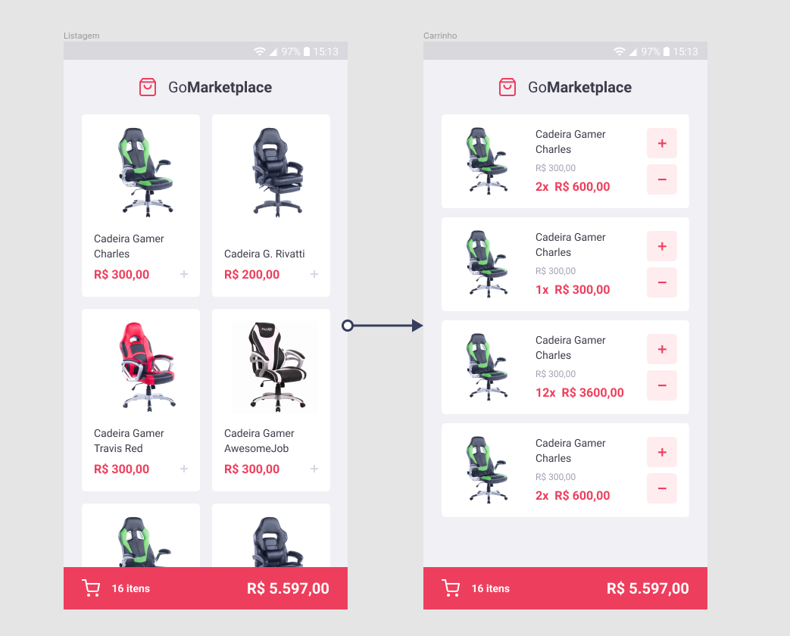
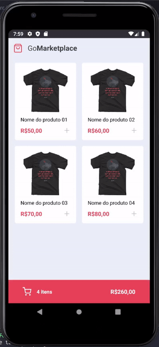
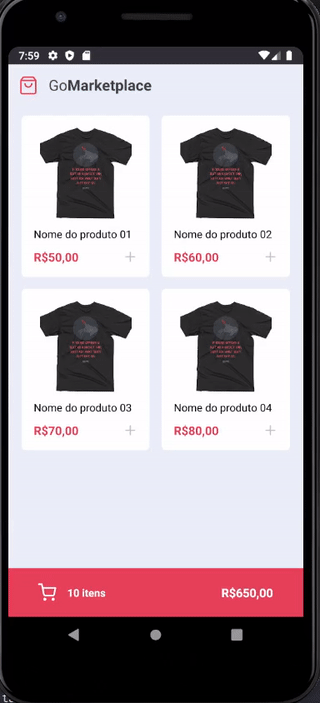

# GoMarket
Desafio GoStack - Aplicativo utilizando ReactNative para compras

A proposta foi a criação de um aplicativo de compras na qual o usuário pudesse adicionar e remover itens de seu carrinho.  Exemplo:

## Dsenvolvimento

Utilizei o conceito de Hooks para que conseguisse trabalhar com o carrinho nas diferentes páginas. Utilizei também o AsyncStorage para que salve e carregue
o progresso de compra. Para as informações dos itens como: titulo, imagem, e preço, utilizei um API "falsa" que fica no mesmo projeto, e para inicializa-la é necessário 
executar o comando  "yarn json-server server.json -p 3333"

### Tela Dashboard

### Tela Cart

